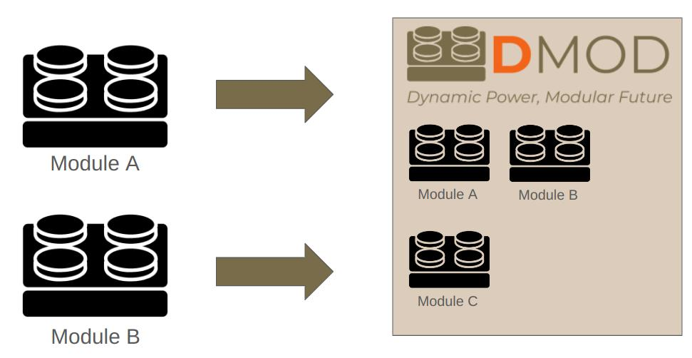
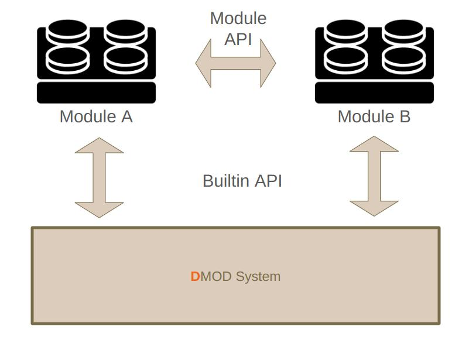

<div style="width: 300px;">
  
</div>

_________


The **Dmod (Dynamic Modules)** library allows you to add the functionality of loading programs and libraries into your **embedded** architecture in runtime mode. This means that you can dynamically extend the capabilities of your embedded system without needing to recompile or restart the entire application. 

### Key Features:
- **Dynamic Loading**: Load and unload modules at runtime.
- **Modular Architecture**: Design your system in a modular way, making it easier to manage and extend.
- **Inter-Module Communication**: Modules can communicate with each other and the system using a common API.
- **Resource Management**: Efficiently manage resources and dependencies between modules.
- **Cross-Platform Support**: Compatible with various embedded platforms.
- **Easy integration**: Integrate Dmod seamlessly into your existing projects with minimal effort.
- **Lightweight**: Designed to be lightweight and efficient, with minimal impact on system performance.
- **Testing on Host**: Test your modules on a host machine before deploying them to the target platform.
- **Safe deployment**: Update modules without affecting the entire system, ensuring safe and reliable operation.

### Use Cases:
- **Firmware Updates**: Apply updates to specific modules without affecting the entire system.
- **Feature Extensions**: Add new features or functionalities on-the-fly.
- **Testing and Debugging**: Load test modules or debugging tools dynamically.
- **Customization**: Customize the behavior of your system based on user input or external conditions.
- **Resource Management**: Manage system resources more efficiently by loading and unloading modules as needed.


By using Dmod, you can achieve greater flexibility and scalability in your embedded systems, ensuring that your applications can adapt to changing requirements and environments.

### Requirements

- **Compiler**: Currently, we only support compilers compatible with GCC.
- **Build System**: We recommend using CMake version 3.18 or higher (older versions have not been tested).
- **Make**: We also support the Make build system, but it must be version 4.2 or newer.
- **Dynamic Memory Allocation**: Your project must support dynamic memory allocation, requiring implementations of `Dmod_Malloc` and `Dmod_Free`.

### Recommended

- **Logging**: We recommend implementing the `Dmod_Printf` function for logging purposes.
- **File System**: If your project supports a file system, you can use it to store and load ***.dmf** files - this will allow for automatic loading of modules' dependencies. 

## What is the Module?



A module is a self-contained unit of code that can be dynamically loaded from a `*.dmf` file and unloaded from the system. Modules can be used to **add new features, extend existing functionality**, or customize the behavior of the system **without requiring a full recompilation or restart.** Moreover, they can communicate with each other and the system using a common API. The **Dmod** library manages the loading and unloading of modules, as well as its dependencies, ensuring that the system remains stable and efficient.

Moreover, modules can be **developed and tested independently of the main application**, allowing for easier development, debugging, and sharing across projects. This modular approach makes it easier to manage and extend the system, as well as adapt it to changing requirements and environments.

Thanks to the dependencies management, it is possible and easy to not only load the modules only when they are required, but also **unload not used modules to free up the resources.**

## Communication

The **Dmod** library provides a set of APIs that allow modules to communicate with **each other** and **the system**. These APIs are designed to be simple and easy to use, making it easy to develop modular applications that can be extended and customized as needed.



What is more, you don't need to provide the source code of the system or a module to use its API - all you need is the **API declaration**, so only the **header file** is required.

### Built-in API

The communication between a module and the system is done through the **builtin API**. The **Dmod** library provides some interface for the modules on its own, but it is also possible and recommended to define your own API as well. You can easily declare any C function as an API function by using the `DMOD_BUILTIN_API` macro:

**Example**:
```c
// YourFunction prototype 
// It can be accessed by name ModuleNameFunctionName
DMOD_BUILTIN_API( ModuleName, 1.0, void, FunctionName, (int arg1, int arg2));
```

The `DMOD_BUILTIN_API` macro takes the following arguments:
- **Module Name**: The name/group of the module that the API function belongs to. (can be empty)
- **Version**: The version of the **function** (not the module) - helps in the future to maintain compatibility.
- **Return Type**: The return type of the function.
- **Function Name**: The name of the function.
- **Arguments**: The arguments of the function.

Your function will be accessible in the system and the modules by the name `<ModuleName><FunctionName>`, so for the example above, it would be `ModuleNameYourFunction`. There is nothing unusual in the usage of the function, so calling it is as simple as calling any other function:

```c
ModuleNameYourFunction(1, 2);
```

To implement the API function, you can either just use the default C function declaration or use the `DMOD_INPUT_API_DECLARATION` macro:

**Example version 1**:
```c
// Implement the API function
void ModuleNameYourFunction(int arg1, int arg2)
{
    // Your code here
}
```

**Example version 2**:
```c
// Usage the DMOD_INPUT_API_DECLARATION macro
// to implement the API function - it can 
// be helpful in the future to maintain
// compatibility (versioning)
DMOD_INPUT_API_DECLARATION(ModuleName, 1.0, void, YourFunction, (int arg1, int arg2))
{
    // Your code here
}
```

The second version of the implementation is recommended, as it allows you to maintain compatibility in the future - if the function signature changes, you can support both versions of the function at the same time.

### Module API

Every module can define its own API that can be used by other modules (or the system). To define the API, you need a special header file that is generated for you by the **Dmod** library in the build process - `<module_name>_defs.h`. This file contains the declarations of macros, that allow you to define the API of your module. Once you include this file in your module, you can use the `dmod_<module_name>_api` macro to define the API functions:

**Example**:
```c
#include "my_module_defs.h"

// Define the API function
// It can be accessed by name my_module_foo
dmod_my_module_api( 1.0, void, _foo, (int arg1, int arg2));
```

The `dmod_<module_name>_api` macro takes the following arguments:
- **Version**: The version of the **function** (not the module) - helps in the future to maintain compatibility.
- **Return Type**: The return type of the function.
- **Function Name**: The name of the function.
- **Arguments**: The arguments of the function.

The rules about the naming are similar to the **built-in API**, so your function will be accessible in the system and the modules by the name `<module_name><FunctionName>`, so for the example above, it would be `my_module_foo`. There is nothing unusual in the usage of the function, so calling it is as simple as calling any other function:

```c
my_module_foo(1, 2);
```
> **Note**: In this example, the function name is prefixed with an underscore `_`, resulting in the actual function name being `_foo`. The underscore is used here for better readability, but it is not required, so you can omit it if you prefer - in this case your full name will be `my_modulefoo`.

To implement the API function, you can either just use the default C function declaration or use the `dmod_<module_name>_api_declaration` macro:

**Example version 1**:
```c
// Implement the API function
void my_module_foo(int arg1, int arg2)
{
    // Your code here
}
```

**Example version 2**:
```c
// Usage the dmod_my_module_api_declaration macro
// to implement the API function - it can
// be helpful in the future to maintain
// compatibility (versioning)
dmod_my_module_api_declaration( 1.0, void, foo, (int arg1, int arg2))
{
    // Your code here
}
```

The second version of the implementation is recommended, as it allows you to maintain compatibility in the future - if the function signature changes, you can support both versions of the function at the same time.

> **⚠️ Warning**: Unlike in the `built-in` API, in the module's API the module name is passed automatically by the `dmod_<module_name>_api` macro and cannot be empty - this is required for the dependency management. However, it is still **possible** to define a **function in the global scope** (check the next chapter).

### Global API

Sometimes it is required for your application to define a function in the *global* scope, so with the name that is **not prefixed** with the **module name**. For example names of functions like `printf` or `malloc` are defined by the standard so we cannot add any prefix to them, however as it was already mentioned, the **Dmod** library requires the name of the module for depenedency management. To solve this problem we introduced the macro `dmod_<module_name>_global_api`, which uses the module name in the dependency management, but does not add it to the function name:

**Example**:
```c
#include "my_module_defs.h"

// Define the API function
// It can be accessed by name foo
dmod_my_module_global_api( 1.0, void, foo, (int arg1, int arg2));
```

The `dmod_<module_name>_global_api` macro takes the following arguments:
- **Version**: The version of the **function** (not the module) - helps in the future to maintain compatibility.
- **Return Type**: The return type of the function.
- **Function Name**: The name of the function.
- **Arguments**: The arguments of the function.

Thanks to this macro, the function will be accessible in the system and the modules by the name `<FunctionName>` (so for the example above, it would be `foo`), however the **Dmod** dependency system will treat it as a part of the `my_module` module.

---
## Getting Started

To use the **Dmod** repository, you need to integrate it into your project first. This section will guide you through the initial steps to get started with Dmod, including integration into your project and developing your first module.

### Integration

To get started with **Dmod**, follow these simple steps to integrate it into your embedded system:

1. **Clone the repository**: Add the source code of this repository into your project in a prefered way. We recommend to add it as a git submodule:

```bash
git submodule add https://bitbucket.org/chocotechnologies/dmod.git libs/dmod
git submodule update --init --recursive  # updates the dmod repository with it's submodules
```

2. **Copy the configuration file template**: Depending on your build system, copy the `dmod-cfg.cmake` or `dmod-cfg.mk` file into your project and adapt it to your needs. 

2. **Add the library to your build system**: Link the library `dmod` into your project:


**CMake**:
```CMake
# Set the path to your configuration file
set(DMOD_CFG ${CMAKE_SOURCE_DIR}/dmod-cfg.cmake)

# Add the Dmod directory 
add_subdirectory(libs/dmod)

# Link the Dmod library into the target
target_link_libraries(${PROJECT_NAME} dmod)

# Add the Dmod scripts directory to linker paths
target_link_options(${PROJECT_NAME} PRIVATE -L ${DMOD_SCRIPTS_DIR})
```
    
**Make**:

The `Make` configuration is a little more complicated, because you need to find your linker command and add the `-L ${DMOD_DIR}/scripts` parameter on your own. 

```Makefile
# Set the path to the Dmod library
DMOD_DIR=$(pwd)/libs/dmod 

# Set the path to your configuration file
DMOD_CFG=$(pwd)/dmod-cfg.mk

# Extra rule for building of the dmod library
build_dmod:
  @make -C $(DMOD_DIR) DMOD_CFG="$(DMOD_CFG)"

# #################################################
# 
#   THIS PART DEPENDS ON YOUR PROJECT! 
#
#   You need to add the dmod/scripts directory into
#   your linker command. 
#
#   In GCC you do this by adding:
#                 -L $(DMOD_DIR)/scripts
#   to the command parameters like in the example below 
$(PROJECT_NAME): $(OBJECTS)
	@$(CC) $(CFLAGS) -L $(DMOD_DIR)/scripts -T my_script.ld -o build/app.elf $(OBJECTS)

```

4. **Include `dmod-common.ld` in your linker script**: Find your linker script, and include the `dmod-common.ld` file inside the `.SECTIONS` block:

```ld

SECTIONS
{

    /* Some of your sections */
    ...

    /* Include the dmod definitions */
    INCLUDE dmod-common.ld

    /* More of your sections */
    ...
}
```

5. **Adapt the system API**: The library provides some default implementations of the System Abstract Layer (SAL), which utilize standard libraries such as `stdlib` and `stdio` for resource allocation and logging. These implementations are defined as weak, allowing you to override and customize them to suit your specific needs. 

List of all the API used by the **Dmod** library can be found in the `dmod_sal.h` header, but the **minimum** required API to define includes:

| Function Name        | Description                     | 
| -------------------- | ------------------------------- |
| `Dmod_Malloc`        | *Allocates heap memory*         |
| `Dmod_Free`          | *Releases heap memory*          |
| `Dmod_AlignedAlloc`  | *Allocates heap aligned memory* |


It is also **recommended** (but not mandatory) to define those:

| Function Name        | Description                           | 
| -------------------- | ------------------------------------- |
| `Dmod_Printf`        | *Prints Dmod logs in `printf` format* |
| `Dmod_Mutex_New`     | *Creates new mutex*                   |
| `Dmod_Mutex_Delete`  | *Releases mutex memory*               |
| `Dmod_Mutex_Lock`    | *Locks the mutex*                     |
| `Dmod_Mutex_Unlock`  | *Unlocks the mutex*                   |


### Module Development

To develop an application or library module, you need to create a **DMF (Dmod Module File)**. This file contains the compiled code of your module, as well as the metadata required for loading and unloading it dynamically.

#### Hello World Source Code

Here is an example of a simple "Hello World" module that you can use as a starting point:

**main.c**:
```c
#include "dmod.h"

int main(int argc, char *argv[])
{
    // Dmod_Printf is a system API function that prints messages to the console
    Dmod_Printf("Hello, World!\n");
    return 0;
}
```

The `main.c` file contains the main function of the module, which prints the message "Hello, World!" to the console using the `Dmod_Printf` function - this function is a part of the System Abstract Layer (SAL) and should be implemented in your project. 

The DMOD library supports two build systems: **CMake** and **Make**. You can use either of them to build your module.

#### CMake

To build a module using CMake, you need to create a `CMakeLists.txt` file in the module's directory. This file should include the following commands:

```CMake
cmake_minimum_required(VERSION 3.18)

# Set the module name
set(DMOD_MODULE_NAME        my_module)

# Set the module version
set(DMOD_MODULE_VERSION     "0.1")

# Set the module author (it will be displayed in the module information)
set(DMOD_AUTHOR_NAME        "John Doe")

# Set the stack size required by the module and its priority
set(DMOD_STACK_SIZE         1024)
set(DMOD_PRIORITY           0)

# Add the module executable
dmod_add_executable(${DMOD_MODULE_NAME} ${DMOD_MODULE_VERSION} 
    main.c
)
```

> **Note**: Please note, that `dmod_add_executable` will create a target for your module, which you can use just like any other CMake target.

Once this file is created, you can build the module using the following commands:

```sh
cmake -B build -S .
cmake --build build/
```


---

#### Make

To build a module using Make, you need to create a `Makefile` in the module's directory. This file should include the following commands:

```Makefile

# Set the module name
DMOD_MODULE_NAME=my_module

# Set the module version
DMOD_MODULE_VERSION=0.1

# Set the module author (it will be displayed in the module information)
DMOD_AUTHOR_NAME=John Doe

# Set the stack size required by the module and its priority
DMOD_STACK_SIZE=1024
DMOD_PRIORITY=0

# Set the module sources
DMOD_CSOURCES=main.c
DMOD_CXXSOURCES=

# Set the module include directories, libraries, and definitions
DMOD_INC_DIRS=../library
DMOD_LIBS=
DMOD_DEFINITIONS=


# Add the module executable
include $(DMOD_DMF_APP_FILE_PATH)

```

Once this file is created, you can build the module using the following commands:

```sh
make
```

Regardless of the build system you choose, the output of the build process will be a DMF file that contains the compiled code of your module and it can be found inside the `build/dmf` directory.

## Building

There are two modes for building the project: MODULE mode and SYSTEM mode.

### MODULE Mode
In MODULE mode, you build dynamic modules that can be later run on embedded architectures. You need to transfer the DMF file with your module to the architecture. This can be done by including it in the flash memory, placing it on an SD card, or any other method, as long as Dmod receives a buffer with the data.

To build in MODULE mode, use the following commands:
```sh
cmake -DDMOD_MODE=DMOD_MODULE -B build -S .
cmake --build build/
```

### SYSTEM Mode
In SYSTEM mode, you build the library when you want to include it in your project that will run dynamic modules. The resulting image is then loaded into the microcontroller's memory, allowing it to execute DMF files.

To build in SYSTEM mode, use the following commands:
```sh
cmake -DDMOD_MODE=DMOD_SYSTEM -B build -S .
cmake --build build/
```


---

## License


The MIT License (MIT)

Copyright (c) 2024 Patryk Kubiak

Permission is hereby granted, free of charge, to any person obtaining a copy
of this software and associated documentation files (the "Software"), to deal
in the Software without restriction, including without limitation the rights
to use, copy, modify, merge, publish, distribute, sublicense, and/or sell
copies of the Software, and to permit persons to whom the Software is
furnished to do so, subject to the following conditions:

The above copyright notice and this permission notice shall be included in all
copies or substantial portions of the Software.

THE SOFTWARE IS PROVIDED "AS IS", WITHOUT WARRANTY OF ANY KIND, EXPRESS OR
IMPLIED, INCLUDING BUT NOT LIMITED TO THE WARRANTIES OF MERCHANTABILITY,
FITNESS FOR A PARTICULAR PURPOSE AND NONINFRINGEMENT. IN NO EVENT SHALL THE
AUTHORS OR COPYRIGHT HOLDERS BE LIABLE FOR ANY CLAIM, DAMAGES OR OTHER
LIABILITY, WHETHER IN AN ACTION OF CONTRACT, TORT OR OTHERWISE, ARISING FROM,
OUT OF OR IN CONNECTION WITH THE SOFTWARE OR THE USE OR OTHER DEALINGS IN THE
SOFTWARE.
